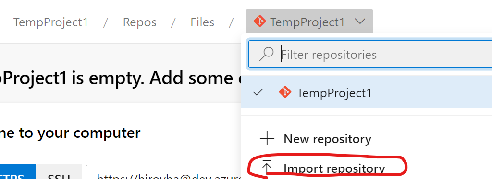
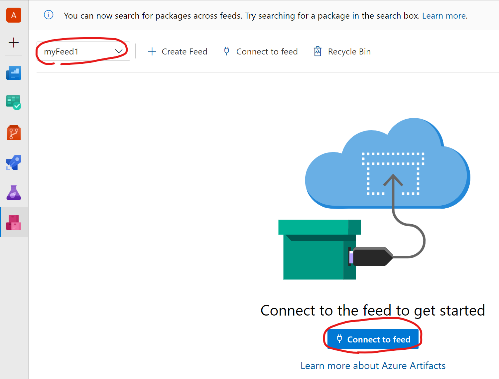
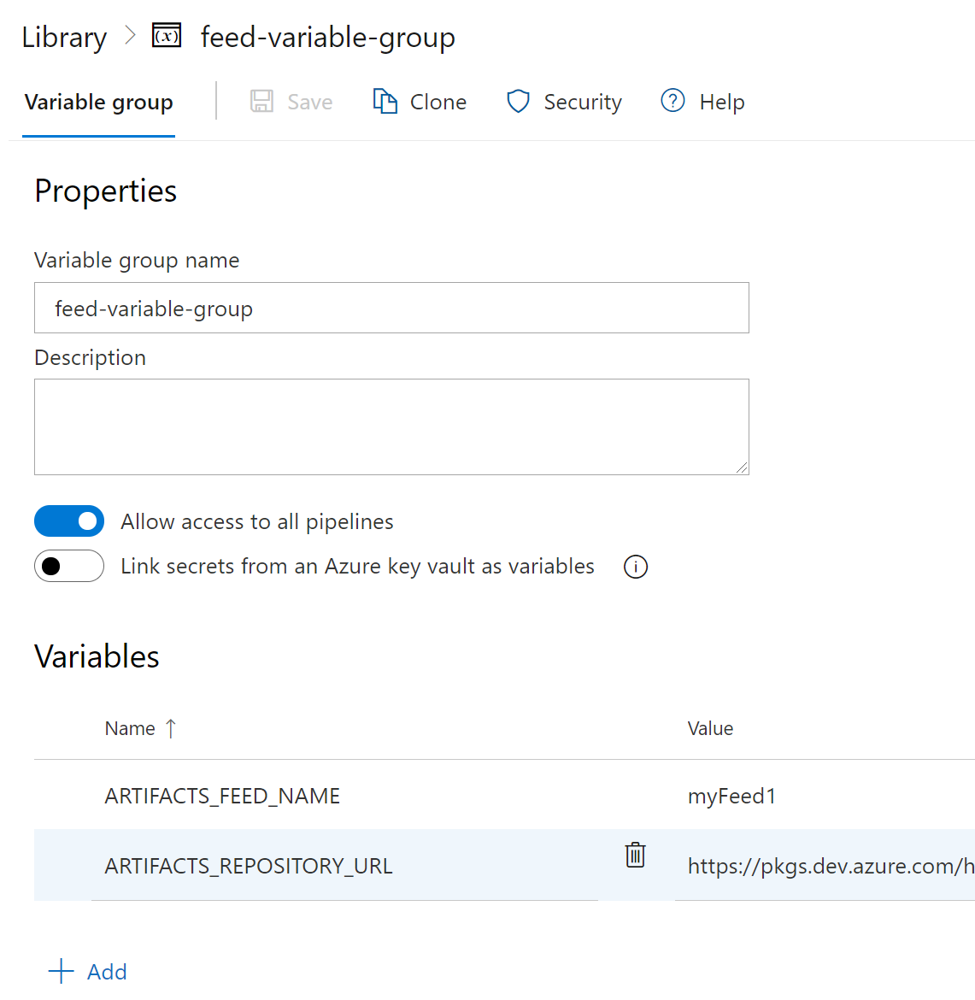

# Lab 1 - Gradle を使用したアーティファクトの公開

このラボでは Azure Pipelines を使用してプロジェクトをビルドし、Azure Artifacts に Maven アーティファクトを公開します。

## リポジトリの取得

1. ブラウザを起動し、Azure DevOps の対象のプロジェクトを開きます。
2. Repos の Files を開きます。
3. 画面上部のプロジェクト名が表示されたドロップダウンをクリックし、"Import Repository" を選択します。

4. Clone URL 欄に "https://github.com/hiroyha1/echo" と入力し、"Import" をクリックします。

## フィードの作成

本プロジェクトによってビルドされる Maven アーティファクトの公開先のフィードを作成します。

1. Artifacts の "Create Feed" をクリックします。
2. Name 欄に任意の名前を入力して "Create" をクリックします。その他の項目は既定値のままで構いません。
  - Visibility ... Members of <組織名>
  - Upstream sources ... チェックを入れる
  - Scope ... Project: <プロジェクト名> (Recommended)
3. 左上のドロップダウンにて作成したフィードが選択されていることを確認し、"Connect to feed" をクリックします。

4. "Gradle" をクリックします。
5. Project setup 欄に記載された url の値を後で参照可能なようにコピーします。

## Variable group の作成

パイプライン内で参照する変数を定義するために Variable group を作成します。

1. Pipelines の Library を開きます。
2. "+ Variable group" をクリックします。
3. Variable group name に "feed-variable-group" と入力します。
4. "+ Add" をクリックし、Variables 欄に以下の 2 つの変数を追加します。

| 名前 | 値 |
|--|--|
| artifacts_feed_name | 作成したフィードの名前 |
| artifacts_repository_url | フィードの作成の手順 5 でコピーした URL |

5. "Save" をクリックし、設定を保存します。



## パイプラインの作成

Gradle プロジェクトをビルドし成果物を Azure Artifaces へ発行するパイプラインを作成します。

1. Pipelines を開きます。
2. "New pipeline" をクリックします。
3. "Where is your code?" と表示される画面で "Azure Repos Git" を選択します。
4. "Select a repository" と表示される画面で "echo" を選択します。
5. "Configure your pipeline" と表示される画面で "Gradle" を選択します。もし "Gradle" が選択肢に無い場合は "Starter pipeline" でも構いません。
6. テンプレートの YAML ファイルが生成されます。この YAML ファイルは既定ではリポジトリのルート ディレクトリ配下に azure-pipelines.yml という名前で保存されます。
7. azure-pipelines.yml の内容を次のように書き換えます。
```yaml
trigger:
- master

pool:
  vmImage: ubuntu-latest

variables:
- group: feed-variable-group

steps:
- task: MavenAuthenticate@0
  inputs:
    artifactsFeeds: $(artifacts_feed_name)
- task: Gradle@2
  inputs:
    workingDirectory: ''
    gradleWrapperFile: 'gradlew'
    gradleOptions: '-Xmx3072m'
    javaHomeOption: 'JDKVersion'
    jdkVersionOption: '1.8'
    jdkArchitectureOption: 'x64'
    publishJUnitResults: true
    testResultsFiles: '**/TEST-*.xml'
    tasks: 'test publish'
```
8. "Save and run" をクリックすると YAML ファイルが保存され、パイプラインが実行されます。
9. Artifacts を開き、`com.contoso.samples:echo` というパッケージが展開されていることを確認します。

ここまで完了したら [Lab 2](https://github.com/hiroyha1/frontapp) に進んでください。

### 解説 - Azure Pipelines について

Azure Pipelines では YAML 形式で実行したい処理 (ビルドや展開など) を記述します。各パイプラインは stage, job, step (task または script) から構成され以下のような階層構造になっています。

```yaml
stages:
- stage: stage1
  jobs:
  - job: job1-1
    steps:
    - task: task1-1-1
    - task: task1-1-1
  - job: job1-2
    steps:
    - task: task1-2-1
- stage: stage2
  jobs:
  - job: job2-1
```

なお、ステージが 1 つしか存在しない場合、さらにジョブが 1 つしか存在しない場合は、それぞれ省略することが可能です。具体的にはステージもジョブも 1 つだけの場合には、それらを省略して以下のように記述できます。

```yaml
steps:
- task: task1
- task: task2
```

1 つのジョブ内のステップは順番に同じエージェント上で実行されます。従って異なる種類のエージェント (Linux と Windows など) で実行したい場合や、複数のエージェントで並列に実行したい場合はジョブの単位で処理を分けます。

また、ステージはパイプライン内の論理的な境界で、例えば以下のような単位で分けることができます。

```yaml
stages:
- stage: ビルド
- stage: QA 環境への展開
- stage: プロダクション環境への展開
```

参考: [Key concepts for new Azure Pipelines users](https://docs.microsoft.com/en-us/azure/devops/pipelines/get-started/key-pipelines-concepts?view=azure-devops)

### 解説 - ラボで作成したパイプラインについて

```yaml
trigger:
- master
```

master ブランチへの変更をトリガーにパイプラインを実行します。

```yaml
pool:
  vmImage: ubuntu-latest
```

Ubuntu エージェントで各ステップを実行します。

```yaml
variables:
- group: feed-variable-group
```

"Variable group の作成" で作成した feed-variable-group という名前の Variable group を参照します。

```yaml
steps:
- task: MavenAuthenticate@0
    inputs:
    artifactsFeeds: $(ARTIFACTS_FEED_NAME)
```

[Maven Authenticate](https://docs.microsoft.com/en-us/azure/devops/pipelines/tasks/package/maven-authenticate?view=azure-devops) というタスクを実行します。

このタスクは変数 `ARTIFACTS_FEED_NAME` で指定された Azure Artifacts のフィードの認証情報を `~/.m2/settings.xml` ファイルに出力します。なお、@ の後ろの数字は、このタスクのバージョン (バージョン 0) を表します。

```yaml
- task: Gradle@2
    inputs:
    workingDirectory: ''
    gradleWrapperFile: 'gradlew'
    gradleOptions: '-Xmx3072m'
    javaHomeOption: 'JDKVersion'
    jdkVersionOption: '1.8'
    jdkArchitectureOption: 'x64'
    publishJUnitResults: true
    testResultsFiles: '**/TEST-*.xml'
    tasks: 'test publish'
```

[Gradle](https://docs.microsoft.com/en-us/azure/devops/pipelines/tasks/build/gradle?view=azure-devops) というタスクを実行します。

このタスクは tasks で指定した Gradle のタスクを実行します。ここでは test と publish の 2 つのタスクを実行しています。

## おまけ

### 問題 1.

手動で作成したパイプラインを実行してみましょう。その際 "Enable system diagnostics" にチェックを入れ、パイプライン実行時の詳細ログを確認してみましょう。

### 問題 2.

Readme.md の更新時にはパイプラインを実行させないように azure-pipelines.yml を変更してみましょう。

ヒント: [exclude](https://docs.microsoft.com/en-us/azure/devops/pipelines/repos/azure-repos-git?view=azure-devops&tabs=yaml#paths)

### 問題 3.

azure-pipelines.yml 及び Repos の設定に次の変更を加えてみましょう。

- Gradle タスクを test と publish の 2 つのタスクに分離
- Pull Request をトリガーにパイプラインが実行されるように変更
  - ヒント: [branch policy](https://docs.microsoft.com/en-us/azure/devops/repos/git/branch-policies?view=azure-devops#build-validation) 
- Pull Request 時は publish のタスクが実行されないように変更
  - ヒント: [condition](https://docs.microsoft.com/en-us/azure/devops/pipelines/process/conditions?view=azure-devops&tabs=yaml)
